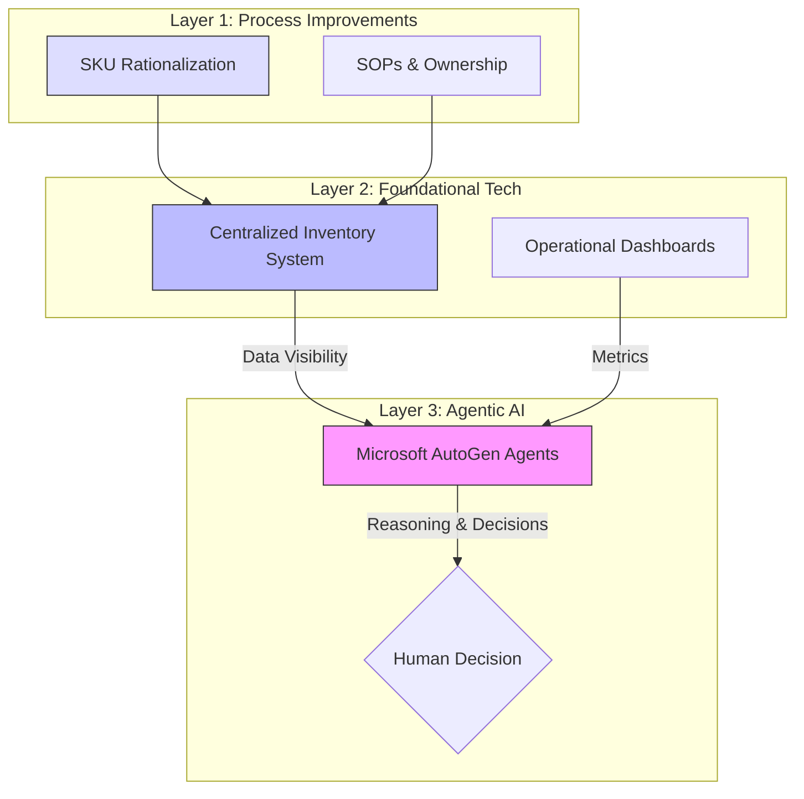
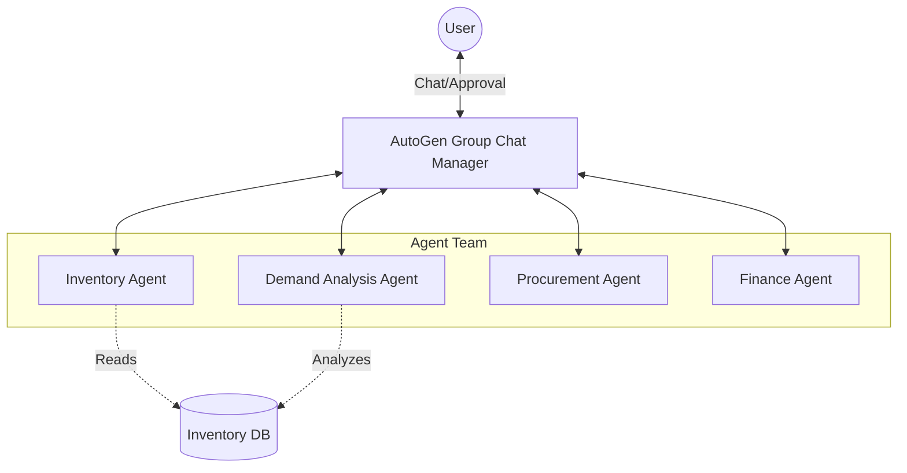
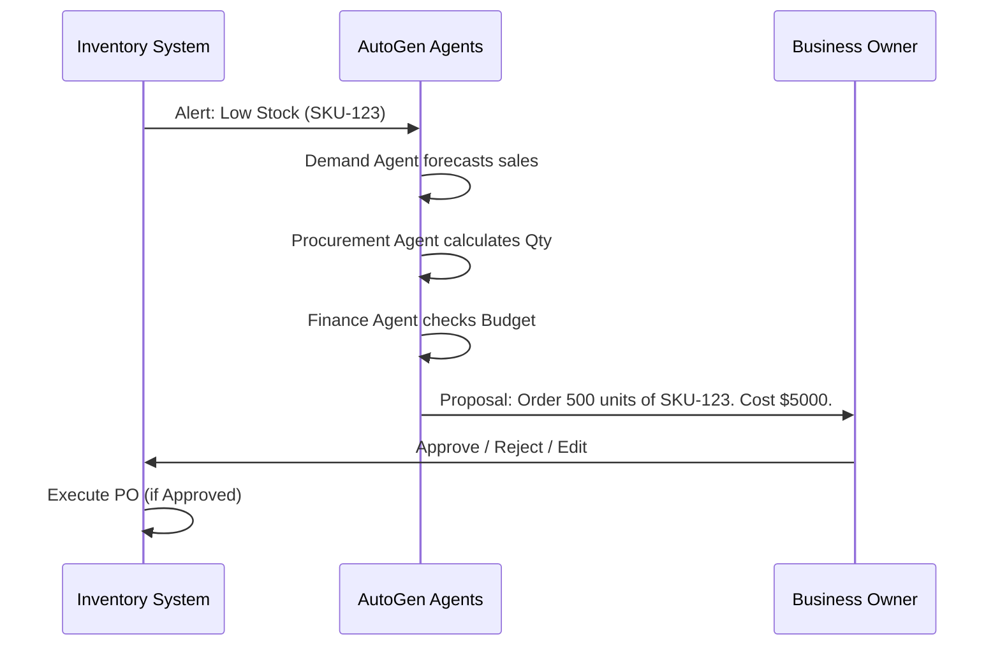

# inventory Problem Solving: A 3-Layer Approach

## 1. Key Challenges
Indian material businesses face systemic inventory issues that kill margins and scalability:
*   **Dead/Slow Inventory**: Capital locked in poor-performing SKUs.
*   **Overstocking**: Warehousing space wasted on low-value items.
*   **Frequent Stockouts**: Missed sales on fast-moving items.
*   **Manual Tracking**: Errors, delays, and reliance on "gut feeling".
*   **Scaling Fear**: Operations dependent on owner's physical presence.

## 2. Problem Analysis
The root cause is not just a lack of software. It is a combination of **weak processes**, **limited visibility**, and **absence of decision intelligence**.
Effective solutions must fix the process first, enable tracking next, and then apply intelligence.

## 3. Solution Overview
We propose a **Three-Layer Solution** to transform inventory operations.

### Layered Solution Diagram

## 4. Layer 1 – Process Improvements (Non-Tech)
Before writing code, we must enforce discipline.

### 4.1 SKU Classification & Rationalization
*   **ABC Analysis**: Classify by Sales Contribution (High/Mid/Low).
*   **Velocity**: Fast / Slow / Dead.
*   **Impact**: Focus on what matters, liquidate what doesn't.

### Inventory Problems vs Business Impact
| Problem | Business Impact |
| :--- | :--- |
| **Dead Stock** | Blocked Working Capital, Storage Costs |
| **Stockouts** | Lost Revenue, Customer Churn |
| **Manual Errors** | Discrepancies, Theft/Pilferage |
| **No SOPs** | Owner Dependency, Inability to Scale |

### 4.2 Inventory Ownership & Accountability
*   Assign **Category Owners** responsible for replenishment and clearance.
*   Reduces ad-hoc purchasing and blame-shifting.

### 4.3 Standard Operating Procedures (SOPs)
*   **Fixed Reorder Cycles**: Order only on Tuesdays (e.g.).
*   **Thresholds**: strict Min/Max levels.
*   **Approvals**: Digital or paper trail for exceptions.

## 5. Layer 2 – Foundational Technology Enablement
The "System of Record".

### 5.1 Centralized Inventory System (Next.js + Express)
*   **SKU-Level Visibility**: Real-time stock counts.
*   **Inward/Outward Tracking**: Digital entry for every movement.
*   **Stack**: Lightweight custom app (Next.js Frontend, Express Backend).

### 5.2 Operational Dashboards
*   **Metrics**: Stock Aging, Sell-through Rate, Turnover.
*   **Goal**: Enable *human* decision making with accurate data.

## 6. Layer 3 – Agentic AI (Microsoft AutoGen)
The "System of Intelligence". Once data is reliable, AI agents take over complex reasoning.

### Why Agentic AI?
Unlike simple scripts, Agents can **reason** across constraints (cash flow vs. demand) and **collaborate**.

## 7. Agentic AI Architecture
We use **Microsoft AutoGen** to orchestrate a team of specialized agents.

### Architecture Diagram

*   **Inventory Agent**: Monitors levels, aging, and alerts.
*   **Demand Agent**: Analyzes sales trends and seasonality.
*   **Procurement Agent**: Calculates reorder quantities (EOQ).
*   **Finance Agent**: Checks budget/cash flow before approving.

## 8. Decision Flow with Human-in-the-Loop
AI proposes, Human disposes.

### Decision Flow Diagram

## 9. Key Use Cases
1.  **Dead Inventory Management**: Proactively flag items >90 days old and suggest discounts.
2.  **Intelligent Replenishment**: Dynamic reordering based on real demand, not static rules.
3.  **What-If Analysis**: "If supplier X is delayed, will we stock out?"

## 10. Conclusion
By layering **Process Discipline**, **Foundational Tech**, and **Agentic AI**, we solve the visibility crisis and unlock growth. Technology alone is not the answer; Intelligence is.
